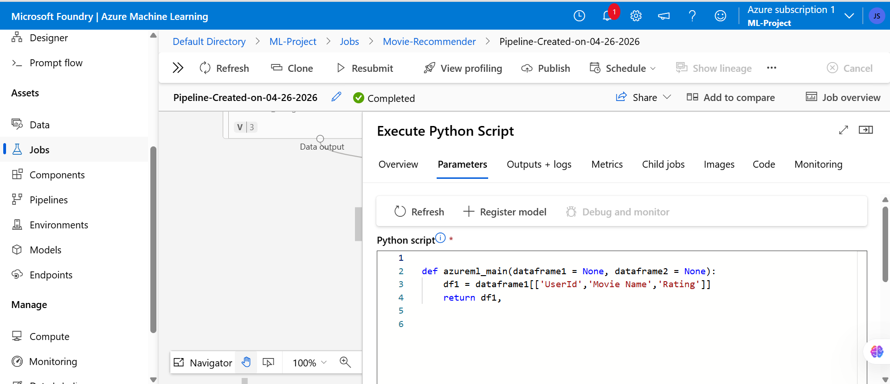

# 🎬 Movie Recommendation System using Azure Machine Learning


An end-to-end movie recommendation system built with Azure Machine Learning, featuring collaborative filtering using SVD matrix factorization and real-time deployment capabilities on Azure Container Instances.

---

## 📋 Table of Contents

- [Overview](#-overview)
- - [Architecture](#-architecture)
  - - [Technologies Used](#-technologies-used)
    - - [Dataset](#-dataset)
      - - [Azure ML Pipeline](#-azure-ml-pipeline)
        - - [Model Performance](#-model-performance)
          - - [Sample Results](#-sample-results)
            - - [Deployment](#-deployment)
              - - [Installation & Usage](#-installation--usage)
                - - [Future Enhancements](#-future-enhancements)
                  - - [Contact](#-contact)
                   
                    - ---

                    ## 🎯 Overview

                    This project implements a production-ready movie recommendation system leveraging Azure Machine Learning's cloud infrastructure. The system processes movie ratings data to generate personalized recommendations using collaborative filtering (SVD) with real-time inference served via Azure Container Instances.

                    **Project Objectives:**
                    - Build a scalable recommendation engine using Azure ML Designer
                    - - Deploy a real-time inference endpoint via Azure Container Instances
                      - - Implement an end-to-end ML pipeline with data ingestion, preprocessing, training, scoring, and evaluation
                        - - Achieve strong recommendation accuracy with optimized SVD matrix factorization
                         
                          - ---

                          ## 🏗️ Architecture

                          The system follows a cloud-native pipeline architecture across six stages:

                          

                          | Step | Component | Purpose |
                          |------|-----------|---------|
                          | 1 | User & Movie Interaction Data | Raw ratings input |
                          | 2 | Azure Blob Storage | Scalable cloud data store |
                          | 3 | Data Science Virtual Machine (DSVM) | Model training compute |
                          | 4 | Azure Machine Learning Service | Pipeline orchestration & model registry |
                          | 5 | Azure Cosmos DB | Persistent recommendation storage |
                          | 6 | Azure Container Instances | Real-time model serving endpoint |

                          ---

                          ## 🛠️ Technologies Used

                          **Cloud Platform:**
                          - Azure Machine Learning Studio (Designer)
                          - - Azure Blob Storage
                            - - Azure Container Instances
                              - - Azure Cosmos DB
                                - - Data Science Virtual Machine (DSVM)
                                 
                                  - **Programming & Libraries:**
                                  - - Python 3.8+
                                    - - Pandas & NumPy (Data manipulation)
                                      - - Scikit-learn (Machine Learning utilities)
                                        - - Azure ML SDK (Pipeline & deployment)
                                         
                                          - **Algorithms:**
                                          - - SVD (Singular Value Decomposition) — via Azure ML Train SVD Recommender
                                            - - Matrix Factorization
                                              - - Content-Based Filtering (cosine similarity fallback)
                                               
                                                - ---

                                                ## 📊 Dataset

                                                - **Source:** MovieLens dataset
                                                - - **Scale:** 22,483 scored user-item pairs in the test set
                                                  - - **Features:** UserId, Movie Name, Rating
                                                    - - **Task:** Predict user ratings for unseen movies
                                                     
                                                      - ---

                                                      ## 🔧 Azure ML Pipeline

                                                      The full ML pipeline was built and executed in Azure ML Designer:

                                                      

                                                      **Pipeline Steps:**
                                                      1. **Data Ingestion** — `movie_ratings` and `imdb_movie_titles` datasets loaded from registered Azure ML datasets
                                                      2. 2. **Join Data** — Merge ratings with movie metadata on movie ID
                                                         3. 3. **Execute Python Script** — Select and clean relevant columns (`UserId`, `Movie Name`, `Rating`)
                                                            4. 4. **Remove Duplicate Rows** — Deduplicate merged dataset
                                                               5. 5. **Split Data** — Train/test split for model evaluation
                                                                  6. 6. **Train SVD Recommender** — Train matrix factorization model on training set
                                                                     7. 7. **Score SVD Recommender** — Generate predicted ratings on test set
                                                                        8. 8. **Evaluate Recommender** — Compute evaluation metrics
                                                                          
                                                                           9. **Python Preprocessing Script (Execute Python Script module):**
                                                                          
                                                                           10. 
                                                                          
                                                                           11. ```python
                                                                               def azureml_main(dataframe1=None, dataframe2=None):
                                                                                   df1 = dataframe1[['UserId', 'Movie Name', 'Rating']]
                                                                                   return df1,
                                                                               ```

                                                                               ---

                                                                               ## 📈 Model Performance

                                                                               The pipeline completed successfully on **April 26, 2026**:

                                                                               

                                                                               | Metric | Score |
                                                                               |--------|-------|
                                                                               | **MAE** | 1.287 |
                                                                               | **RMSE** | 1.708 |
                                                                               | **R²** | 0.150 |
                                                                               | **Explained Variance** | 0.150 |

                                                                               **Pipeline Status:** ✅ Completed
                                                                               **Job:** `Pipeline-Created-on-04-26-2026` under `Movie-Recommender` experiment

                                                                               ---

                                                                               ## 🎬 Sample Results

                                                                               The scored dataset contains 22,483 user-movie pairs with predicted ratings:

                                                                               

                                                                               **Sample Recommendations (Scored Output):**

                                                                               | User ID | Movie | Predicted Rating |
                                                                               |---------|-------|-----------------|
                                                                               | 17347 | Django Unchained (2012) | 8.02 |
                                                                               | 8219 | American Hustle (2013) | 7.48 |
                                                                               | 9540 | Indie Game: The Movie (2012) | 7.41 |
                                                                               | 10878 | The Way (2010) | 7.36 |
                                                                               | 4881 | The World's End (2013) | 6.90 |
                                                                               | 674 | The Hangover Part III (2013) | 6.55 |
                                                                               | 20041 | Hustle & Flow (2005) | 6.80 |

                                                                               ---

                                                                               ## 🚀 Deployment

                                                                               **Real-time Endpoint via Azure Container Instances:**
                                                                               - Deployed via Azure ML Managed Endpoints
                                                                               - - Auto-scaling enabled (min 1, max 5 instances)
                                                                                 - - Authentication: Key-based
                                                                                   - - Monitoring enabled with Application Insights
                                                                                    
                                                                                     - **API Usage Example:**
                                                                                    
                                                                                     - ```python
                                                                                       import requests
                                                                                       import json

                                                                                       endpoint_url = "https://your-endpoint.azureml.net/score"
                                                                                       api_key = "your-api-key"

                                                                                       headers = {
                                                                                           "Content-Type": "application/json",
                                                                                           "Authorization": f"Bearer {api_key}"
                                                                                       }

                                                                                       data = {
                                                                                           "user_id": 123,
                                                                                           "top_n": 10
                                                                                       }

                                                                                       response = requests.post(endpoint_url, headers=headers, data=json.dumps(data))
                                                                                       recommendations = response.json()
                                                                                       print(recommendations)
                                                                                       ```

                                                                                       ---

                                                                                       ## 💻 Installation & Usage

                                                                                       ### Prerequisites
                                                                                       - Python 3.8+
                                                                                       - - Azure subscription with an ML workspace
                                                                                         - - Azure CLI installed
                                                                                          
                                                                                           - ### Local Setup
                                                                                          
                                                                                           - ```bash
                                                                                             # Clone repository
                                                                                             git clone https://github.com/JaswantOnGit/Movie-Recommendation-System-Using-Azure-Machine-Learning.git
                                                                                             cd Movie-Recommendation-System-Using-Azure-Machine-Learning

                                                                                             # Create virtual environment
                                                                                             python -m venv venv
                                                                                             source venv/bin/activate  # On Windows: venv\Scripts\activate

                                                                                             # Install dependencies
                                                                                             pip install -r requirements.txt

                                                                                             # Set up Azure credentials
                                                                                             az login
                                                                                             az account set --subscription <your-subscription-id>
                                                                                             ```

                                                                                             ---

                                                                                             ## 🔮 Future Enhancements

                                                                                             - Implement deep learning models (Neural Collaborative Filtering)
                                                                                             - - Add explainability features (LIME/SHAP) for recommendation transparency
                                                                                               - - Integrate reinforcement learning for adaptive recommendations
                                                                                                 - - A/B testing framework for model comparison
                                                                                                   - - Real-time user feedback loop for continuous retraining
                                                                                                     - - Multi-modal recommendations (trailers, posters)
                                                                                                       - - Implement diversity and serendipity metrics
                                                                                                         - - Deploy batch inference pipeline for offline scoring
                                                                                                          
                                                                                                           - ---
                                                                                                           
                                                                                                           ## 📞 Contact
                                                                                                           
                                                                                                           **Jay Banga**
                                                                                                           - LinkedIn: [linkedin.com/in/jaybanga](https://linkedin.com/in/jaybanga)
                                                                                                           - - GitHub: [JaswantOnGit](https://github.com/JaswantOnGit)
                                                                                                            
                                                                                                             - ---
                                                                                                             
                                                                                                             ## 📝 License
                                                                                                             
                                                                                                             This project is licensed under the MIT License.
                                                                                                             
                                                                                                             ---
                                                                                                             
                                                                                                             ## 🙏 Acknowledgments
                                                                                                             
                                                                                                             - Azure Machine Learning documentation and community
                                                                                                             - - Open-source Python libraries and their maintainers
                                                                                                              
                                                                                                               - ---
                                                                                                               
                                                                                                               ⭐ If you found this project helpful, please consider giving it a star! ⭐
                                                                                                               
