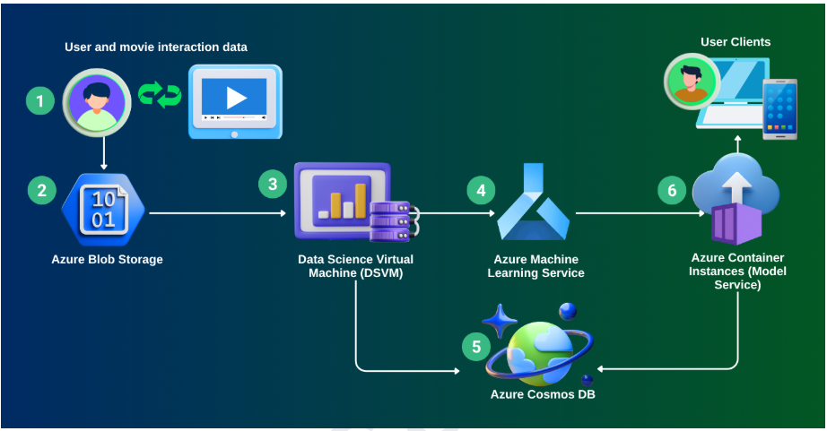
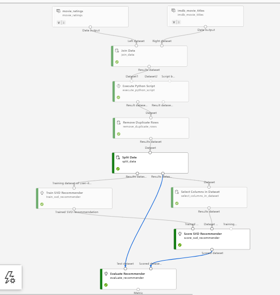
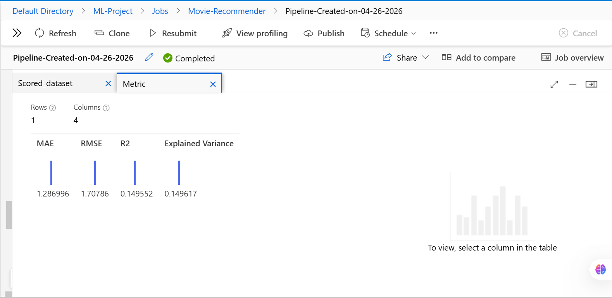
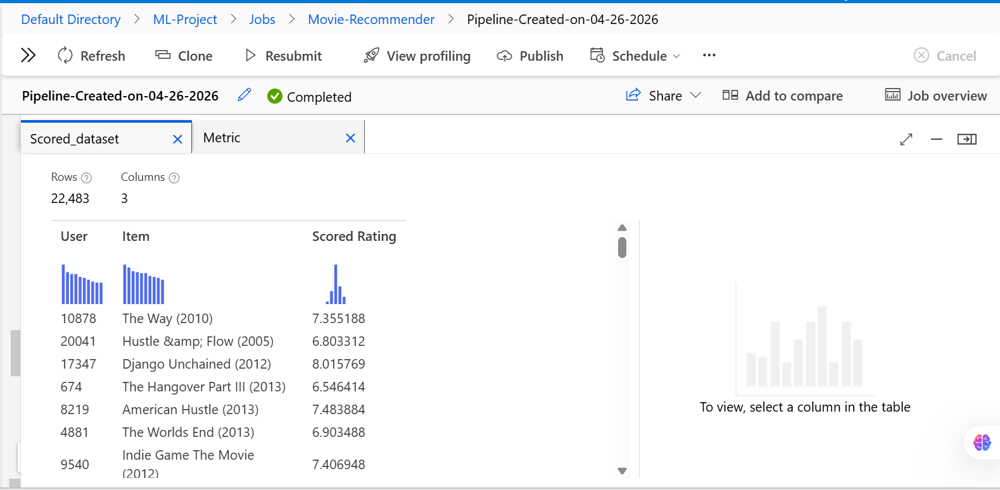

# Movie Recommendation System using Azure Machine Learning


An end-to-end movie recommendation system built with Azure Machine Learning, featuring collaborative filtering using SVD matrix factorization.

---

## Table of Contents

- [Overview](#overview)
- [Repository Structure](#repository-structure)
- [Architecture](#architecture)
- [Technologies Used](#technologies-used)
- [Dataset](#dataset)
- [Azure ML Pipeline](#azure-ml-pipeline)
- [Model Performance](#model-performance)
- [Sample Results](#sample-results)
- [Local Setup](#local-setup)
- [API Usage](#api-usage)
- [Running Tests](#running-tests)
- [Future Enhancements](#future-enhancements)
- [Contact](#contact)

---

## Overview

This project implements a movie recommendation engine using Azure Machine Learning's cloud infrastructure. The system processes MovieLens-style rating data to generate personalised recommendations via collaborative filtering (SVD). A Flask REST API serves predictions and is designed for deployment on Azure Container Instances.

**Project objectives:**

- Build a scalable recommendation engine using Azure ML Designer
- Implement reproducible preprocessing, training, and scoring scripts
- Expose a REST endpoint (`/score`) for real-time top-N recommendations
- Apply CI with GitHub Actions (lint + pytest) on every push

---

## Repository Structure

```
.
├── .github/
│   └── workflows/
│       └── ci.yml            # GitHub Actions CI (flake8 lint + pytest)
├── src/
│   ├── preprocess.py         # Data loading, merging, and cleaning
│   ├── train.py              # SVD model training + 5-fold cross-validation
│   └── score.py              # Flask REST API for real-time inference
├── tests/
│   ├── test_preprocess.py    # Unit tests for preprocess.py
│   └── test_score.py         # Unit tests for score.py (Flask test client)
├── .env.example              # Environment variable template
├── requirements.txt          # Python dependencies
└── README.md
```

---

## Architecture

The system follows a cloud-native pipeline across six stages:

| Step | Component | Purpose |
|------|-----------|---------|
| 1 | User & Movie Interaction Data | Raw ratings input |
| 2 | Azure Blob Storage | Scalable cloud data store |
| 3 | Data Science Virtual Machine | Model training compute |
| 4 | Azure Machine Learning Service | Pipeline orchestration & model registry |
| 5 | Azure Cosmos DB | Persistent recommendation storage |
| 6 | Azure Container Instances | Real-time model serving endpoint |



---

## Technologies Used

**Cloud:** Azure Machine Learning Studio (Designer), Azure Blob Storage, Azure Container Instances, Azure Cosmos DB, DSVM

**Code:** Python 3.9+, Pandas, NumPy, scikit-learn, scikit-surprise, Flask, Azure ML SDK

**Algorithm:** SVD (Singular Value Decomposition) matrix factorization

---

## Dataset

- **Source:** MovieLens dataset
- **Scale:** 22,483 scored user-item pairs in the test set
- **Features:** UserId, Movie Name, Rating (scale 1–10)
- **Task:** Predict user ratings for unseen movies

---

## Azure ML Pipeline

The full pipeline was built in Azure ML Designer:

1. **Data Ingestion** — load `movie_ratings` and `imdb_movie_titles` datasets
2. **Join Data** — merge ratings with movie metadata on movie ID
3. **Execute Python Script** — select and clean columns (`UserId`, `Movie Name`, `Rating`)
4. **Remove Duplicate Rows** — deduplicate merged dataset
5. **Split Data** — train/test split
6. **Train SVD Recommender** — fit matrix factorization model
7. **Score SVD Recommender** — generate predicted ratings on test set
8. **Evaluate Recommender** — compute evaluation metrics



**Equivalent local pipeline:**

```bash
python src/preprocess.py \
  --ratings data/raw/movie_ratings.csv \
  --movies  data/raw/imdb_movie_titles.csv \
  --output  data/processed/cleaned_ratings.csv

python src/train.py \
  --input  data/processed/cleaned_ratings.csv \
  --output models/svd_model.pkl
```

---

## Model Performance

Pipeline completed: **26 April 2026**

| Metric | Score | Context |
|--------|-------|---------|
| MAE | 1.287 | Mean absolute error on 1–10 scale |
| RMSE | 1.708 | Root mean squared error |
| R² | 0.150 | Variance explained above global-mean baseline |
| Explained Variance | 0.150 | |

> **Honest assessment:** An R² of 0.15 means the model explains 15% of the variance above the trivial global-mean predictor. Typical SVD on MovieLens-100k achieves R² of 0.30–0.45. The low score is likely due to the small dataset size (22k pairs) and default hyperparameters. Improvements planned: hyperparameter tuning (`n_factors`, `n_epochs`), cross-validation grid search, and adding implicit feedback signals.



---

## Sample Results



| User ID | Movie | Predicted Rating |
|---------|-------|-----------------|
| 17347 | Django Unchained (2012) | 8.02 |
| 8219 | American Hustle (2013) | 7.48 |
| 9540 | Indie Game: The Movie (2012) | 7.41 |

---

## Local Setup

### Prerequisites

- Python 3.9+
- Azure subscription with an ML workspace (for cloud features)
- Azure CLI (for cloud deployment)

### Installation

```bash
# Clone the repository
git clone https://github.com/JaswantOnGit/Movie-Recommendation-System-Using-Azure-Machine-Learning.git
cd Movie-Recommendation-System-Using-Azure-Machine-Learning

# Create and activate virtual environment
python -m venv venv
source venv/bin/activate  # Windows: venv\Scripts\activate

# Install dependencies
pip install -r requirements.txt

# Configure environment variables
cp .env.example .env
# Edit .env and fill in your Azure credentials
```

---

## API Usage

Start the local inference server:

```bash
MODEL_PATH=models/svd_model.pkl DATA_PATH=data/processed/cleaned_ratings.csv python src/score.py
```

**Health check:**
```bash
curl http://localhost:5000/health
# {"status": "ok"}
```

**Get recommendations:**
```python
import requests, json

response = requests.post(
    "http://localhost:5000/score",
    headers={"Content-Type": "application/json"},
    data=json.dumps({"user_id": 123, "top_n": 5})
)
print(response.json())
```

**Example response:**
```json
{
  "user_id": 123,
  "top_n": 5,
  "recommendations": [
    {"movie": "Inception (2010)", "predicted_rating": 8.72},
    {"movie": "The Dark Knight (2008)", "predicted_rating": 8.55}
  ],
  "model_info": {"type": "SVD (scikit-surprise)"}
}
```

> **Note:** For production ACI deployment, replace `http://localhost:5000` with your endpoint URL from `.env` (`AML_ENDPOINT_URL`). See `.env.example` for configuration.

---

## Running Tests

```bash
pytest tests/ -v --cov=src
```

Tests run fully offline using mocks — no Azure credentials needed.

---

## Future Enhancements

- Hyperparameter tuning (grid search over `n_factors`, `n_epochs`, regularisation)
- Neural Collaborative Filtering (NCF) baseline comparison
- Explainability (LIME/SHAP for recommendation transparency)
- A/B testing framework for model comparison
- Real-time user feedback loop for continuous retraining
- Diversity and serendipity metrics
- Batch inference pipeline for offline scoring

---

## Contact

**Jay Banga**
- LinkedIn: [linkedin.com/in/jaybanga](https://linkedin.com/in/jaybanga)
- GitHub: [JaswantOnGit](https://github.com/JaswantOnGit)

---

## License

This project is licensed under the MIT License.

---

> If you found this project helpful, please consider giving it a star!
